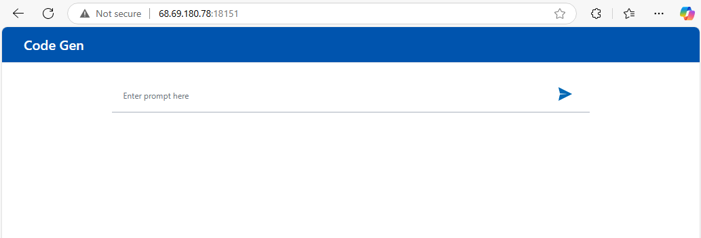
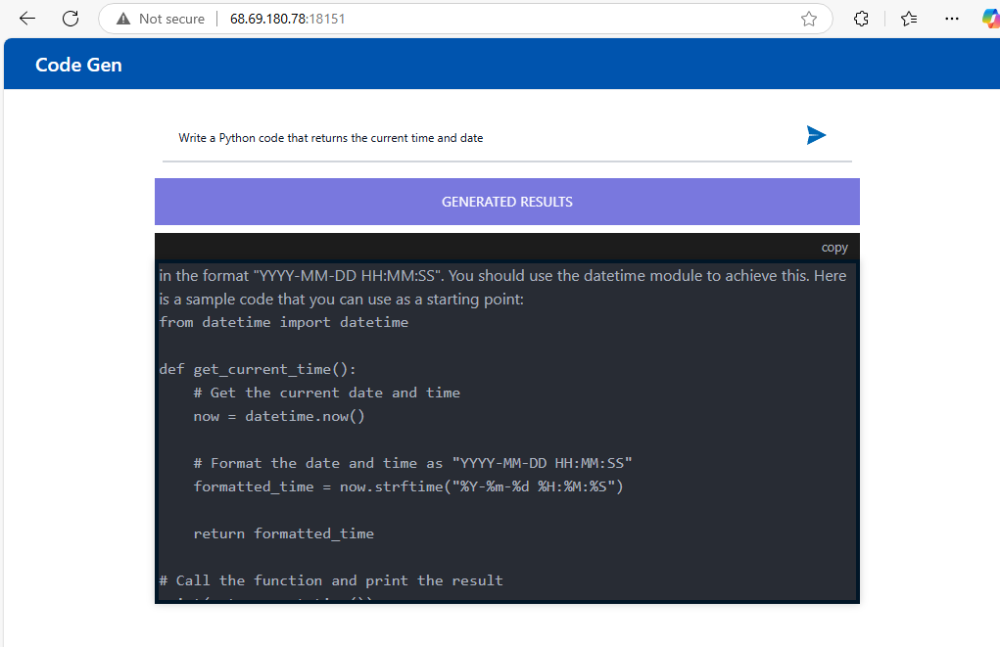

# Build and Deploy CodeGen Application on AMD GPU (ROCm)

## Build Docker Images

### 1. Build Docker Image

- #### Create application install directory and go to it:

  ```bash
  mkdir ~/codegen-install && cd codegen-install
  ```

- #### Clone the repository GenAIExamples (the default repository branch "main" is used here):

  ```bash
  git clone https://github.com/opea-project/GenAIExamples.git
  ```

  If you need to use a specific branch/tag of the GenAIExamples repository, then (v1.3 replace with its own value):

  ```bash
  git clone https://github.com/opea-project/GenAIExamples.git && cd GenAIExamples && git checkout v1.3
  ```

  We remind you that when using a specific version of the code, you need to use the README from this version:

- #### Go to build directory:

  ```bash
  cd ~/codegen-install/GenAIExamples/CodeGen/docker_image_build
  ```

- Cleaning up the GenAIComps repository if it was previously cloned in this directory.
  This is necessary if the build was performed earlier and the GenAIComps folder exists and is not empty:

  ```bash
  echo Y | rm -R GenAIComps
  ```

- #### Clone the repository GenAIComps (the default repository branch "main" is used here):

  ```bash
  git clone https://github.com/opea-project/GenAIComps.git
  ```

  If you use a specific tag of the GenAIExamples repository,
  then you should also use the corresponding tag for GenAIComps. (v1.3 replace with its own value):

  ```bash
  git clone https://github.com/opea-project/GenAIComps.git && cd GenAIComps && git checkout v1.3
  ```

  We remind you that when using a specific version of the code, you need to use the README from this version.

- #### Setting the list of images for the build (from the build file.yaml)

  If you want to deploy a vLLM-based or TGI-based application, then the set of services is installed as follows:

  #### vLLM-based application

  ```bash
  service_list="vllm-rocm llm-textgen codegen codegen-ui"
  ```

  #### TGI-based application

  ```bash
  service_list="llm-textgen codegen codegen-ui"
  ```

- #### Optional. Pull TGI Docker Image (Do this if you want to use TGI)

  ```bash
  docker pull ghcr.io/huggingface/text-generation-inference:2.3.1-rocm
  ```

- #### Build Docker Images

  ```bash
  docker compose -f build.yaml build ${service_list} --no-cache
  ```

  After the build, we check the list of images with the command:

  ```bash
  docker image ls
  ```

  The list of images should include:

  ##### vLLM-based application:

  - opea/vllm-rocm:latest
    - opea/llm-textgen:latest
    - opea/codegen:latest
    - opea/codegen-ui:latest

  ##### TGI-based application:

  - ghcr.io/huggingface/text-generation-inference:2.3.1-rocm
    - opea/llm-textgen:latest
    - opea/codegen:latest
    - opea/codegen-ui:latest

---

## Deploy the CodeGen Application

### Docker Compose Configuration for AMD GPUs

To enable GPU support for AMD GPUs, the following configuration is added to the Docker Compose file:

- compose_vllm.yaml - for vLLM-based application
- compose.yaml - for TGI-based

```yaml
shm_size: 1g
devices:
  - /dev/kfd:/dev/kfd
  - /dev/dri/:/dev/dri/
cap_add:
  - SYS_PTRACE
group_add:
  - video
security_opt:
  - seccomp:unconfined
```

This configuration forwards all available GPUs to the container. To use a specific GPU, specify its `cardN` and `renderN` device IDs. For example:

```yaml
shm_size: 1g
devices:
  - /dev/kfd:/dev/kfd
  - /dev/dri/card0:/dev/dri/card0
  - /dev/dri/render128:/dev/dri/render128
cap_add:
  - SYS_PTRACE
group_add:
  - video
security_opt:
  - seccomp:unconfined
```

**How to Identify GPU Device IDs:**
Use AMD GPU driver utilities to determine the correct `cardN` and `renderN` IDs for your GPU.

### Set deploy environment variables

#### Setting variables in the operating system environment:

##### Set variable HUGGINGFACEHUB_API_TOKEN:

```bash
### Replace the string 'your_huggingfacehub_token' with your HuggingFacehub repository access token.
export HUGGINGFACEHUB_API_TOKEN='your_huggingfacehub_token'
```

#### Set variables value in set_env\*\*\*\*.sh file:

Go to Docker Compose directory:

```bash
cd ~/codegen-install/GenAIExamples/CodeGen/docker_compose/amd/gpu/rocm
```

The example uses the Nano text editor. You can use any convenient text editor:

#### If you use vLLM

```bash
nano set_env_vllm.sh
```

#### If you use TGI

```bash
nano set_env.sh
```

If you are in a proxy environment, also set the proxy-related environment variables:

```bash
export http_proxy="Your_HTTP_Proxy"
export https_proxy="Your_HTTPs_Proxy"
```

Set the values of the variables:

- **HOST_IP, HOST_IP_EXTERNAL** - These variables are used to configure the name/address of the service in the operating system environment for the application services to interact with each other and with the outside world.

  If your server uses only an internal address and is not accessible from the Internet, then the values for these two variables will be the same and the value will be equal to the server's internal name/address.

  If your server uses only an external, Internet-accessible address, then the values for these two variables will be the same and the value will be equal to the server's external name/address.

  If your server is located on an internal network, has an internal address, but is accessible from the Internet via a proxy/firewall/load balancer, then the HOST_IP variable will have a value equal to the internal name/address of the server, and the EXTERNAL_HOST_IP variable will have a value equal to the external name/address of the proxy/firewall/load balancer behind which the server is located.

  We set these values in the file set_env\*\*\*\*.sh

- **Variables with names like "**\*\*\*\*\*\*\_PORT"\*\* - These variables set the IP port numbers for establishing network connections to the application services.
  The values shown in the file set_env.sh or set_env_vllm they are the values used for the development and testing of the application, as well as configured for the environment in which the development is performed. These values must be configured in accordance with the rules of network access to your environment's server, and must not overlap with the IP ports of other applications that are already in use.

#### Set variables with script set_env\*\*\*\*.sh

#### If you use vLLM

```bash
. set_env_vllm.sh
```

#### If you use TGI

```bash
. set_env.sh
```

### Start the services:

#### If you use vLLM

```bash
docker compose -f compose_vllm.yaml up -d
```

#### If you use TGI

```bash
docker compose -f compose.yaml up -d
```

All containers should be running and should not restart:

If you use vLLM:

- codegen-vllm-service
- codegen-llm-server
- codegen-backend-server
- codegen-ui-server

If you use TGI:

- codegen-tgi-service
- codegen-llm-server
- codegen-backend-server
- codegen-ui-server

---

## Validate the Services

### 1. Validate the vLLM/TGI Service

#### If you use vLLM:

```bash
DATA='{"model": "Qwen/Qwen2.5-Coder-7B-Instruct", '\
'"messages": [{"role": "user", "content": "Implement a high-level API for a TODO list application. '\
'The API takes as input an operation request and updates the TODO list in place. '\
'If the request is invalid, raise an exception."}], "max_tokens": 256}'

curl http://${HOST_IP}:${CODEGEN_VLLM_SERVICE_PORT}/v1/chat/completions \
  -X POST \
  -d "$DATA" \
  -H 'Content-Type: application/json'
```

Checking the response from the service. The response should be similar to JSON:

````json
{
  "id": "chatcmpl-142f34ef35b64a8db3deedd170fed951",
  "object": "chat.completion",
  "created": 1742270316,
  "model": "Qwen/Qwen2.5-Coder-7B-Instruct",
  "choices": [
    {
      "index": 0,
      "message": {
        "role": "assistant",
        "content": "```python\nfrom typing import Optional, List, Dict, Union\nfrom pydantic import BaseModel, validator\n\nclass OperationRequest(BaseModel):\n    # Assuming OperationRequest is already defined as per the given text\n    pass\n\nclass UpdateOperation(OperationRequest):\n    new_items: List[str]\n\n    def apply_and_maybe_raise(self, updatable_item: \"Updatable todo list\") -> None:\n        # Assuming updatable_item is an instance of Updatable todo list\n        self.validate()\n        updatable_item.add_items(self.new_items)\n\nclass Updatable:\n    # Abstract class for items that can be updated\n    pass\n\nclass TodoList(Updatable):\n    # Class that represents a todo list\n    items: List[str]\n\n    def add_items(self, new_items: List[str]) -> None:\n        self.items.extend(new_items)\n\ndef handle_request(operation_request: OperationRequest) -> None:\n    # Function to handle an operation request\n    if isinstance(operation_request, UpdateOperation):\n        operation_request.apply_and_maybe_raise(get_todo_list_for_update())\n    else:\n        raise ValueError(\"Invalid operation request\")\n\ndef get_todo_list_for_update() -> TodoList:\n    # Function to get the todo list for update\n    # Assuming this function returns the",
        "tool_calls": []
      },
      "logprobs": null,
      "finish_reason": "length",
      "stop_reason": null
    }
  ],
  "usage": { "prompt_tokens": 66, "total_tokens": 322, "completion_tokens": 256, "prompt_tokens_details": null },
  "prompt_logprobs": null
}
````

If the service response has a meaningful response in the value of the "choices.message.content" key,
then we consider the vLLM service to be successfully launched

#### If you use TGI:

```bash
DATA='{"inputs":"Implement a high-level API for a TODO list application. '\
'The API takes as input an operation request and updates the TODO list in place. '\
'If the request is invalid, raise an exception.",'\
'"parameters":{"max_new_tokens":256,"do_sample": true}}'

curl http://${HOST_IP}:${CODEGEN_TGI_SERVICE_PORT}/generate \
  -X POST \
  -d "$DATA" \
  -H 'Content-Type: application/json'
```

Checking the response from the service. The response should be similar to JSON:

````json
{
  "generated_text": " The supported operations are \"add_task\", \"complete_task\", and \"remove_task\". Each operation can be defined with a corresponding function in the API.\n\nAdd your API in the following format:\n\n```\nTODO App API\n\nsupported operations:\n\noperation name           description\n-----------------------  ------------------------------------------------\n<operation_name>         <operation description>\n```\n\nUse type hints for function parameters and return values. Specify a text description of the API's supported operations.\n\nUse the following code snippet as a starting point for your high-level API function:\n\n```\nclass TodoAPI:\n    def __init__(self, tasks: List[str]):\n        self.tasks = tasks  # List of tasks to manage\n\n    def add_task(self, task: str) -> None:\n        self.tasks.append(task)\n\n    def complete_task(self, task: str) -> None:\n        self.tasks = [t for t in self.tasks if t != task]\n\n    def remove_task(self, task: str) -> None:\n        self.tasks = [t for t in self.tasks if t != task]\n\n    def handle_request(self, request: Dict[str, str]) -> None:\n        operation = request.get('operation')\n        if operation == 'add_task':\n            self.add_task(request.get('task'))\n        elif"
}
````

If the service response has a meaningful response in the value of the "generated_text" key,
then we consider the TGI service to be successfully launched

### 2. Validate the LLM Service

```bash
DATA='{"query":"Implement a high-level API for a TODO list application. '\
'The API takes as input an operation request and updates the TODO list in place. '\
'If the request is invalid, raise an exception.",'\
'"max_tokens":256,"top_k":10,"top_p":0.95,"typical_p":0.95,"temperature":0.01,'\
'"repetition_penalty":1.03,"stream":false}'

curl http://${HOST_IP}:${CODEGEN_LLM_SERVICE_PORT}/v1/chat/completions \
  -X POST \
  -d "$DATA" \
  -H 'Content-Type: application/json'
```

Checking the response from the service. The response should be similar to JSON:

````json
{
  "id": "cmpl-4e89a590b1af46bfb37ce8f12b2996f8",
  "choices": [
    {
      "finish_reason": "length",
      "index": 0,
      "logprobs": null,
      "text": " The API should support the following operations:\n\n1. Add a new task to the TODO list.\n2. Remove a task from the TODO list.\n3. Mark a task as completed.\n4. Retrieve the list of all tasks.\n\nThe API should also support the following features:\n\n1. The ability to filter tasks based on their completion status.\n2. The ability to sort tasks based on their priority.\n3. The ability to search for tasks based on their description.\n\nHere is an example of how the API can be used:\n\n```python\ntodo_list = []\napi = TodoListAPI(todo_list)\n\n# Add tasks\napi.add_task(\"Buy groceries\")\napi.add_task(\"Finish homework\")\n\n# Mark a task as completed\napi.mark_task_completed(\"Buy groceries\")\n\n# Retrieve the list of all tasks\nprint(api.get_all_tasks())\n\n# Filter tasks based on completion status\nprint(api.filter_tasks(completed=True))\n\n# Sort tasks based on priority\napi.sort_tasks(priority=\"high\")\n\n# Search for tasks based on description\nprint(api.search_tasks(description=\"homework\"))\n```\n\nIn this example, the `TodoListAPI` class is used to manage the TODO list. The `add_task` method adds a new task to the list, the `mark_task_completed` method",
      "stop_reason": null,
      "prompt_logprobs": null
    }
  ],
  "created": 1742270567,
  "model": "Qwen/Qwen2.5-Coder-7B-Instruct",
  "object": "text_completion",
  "system_fingerprint": null,
  "usage": {
    "completion_tokens": 256,
    "prompt_tokens": 37,
    "total_tokens": 293,
    "completion_tokens_details": null,
    "prompt_tokens_details": null
  }
}
````

If the service response has a meaningful response in the value of the "choices.text" key,
then we consider the vLLM service to be successfully launched

### 3. Validate the MegaService

```bash
DATA='{"messages": "Implement a high-level API for a TODO list application. '\
'The API takes as input an operation request and updates the TODO list in place. '\
'If the request is invalid, raise an exception."}'

curl http://${HOST_IP}:${CODEGEN_BACKEND_SERVICE_PORT}/v1/codegen \
  -H "Content-Type: application/json" \
  -d "$DATA"
```

Checking the response from the service. The response should be similar to text:

```textmate
data: {"id":"cmpl-cc5dc73819c640469f7c7c7424fe57e6","choices":[{"finish_reason":null,"index":0,"logprobs":null,"text":" of","stop_reason":null}],"created":1742270725,"model":"Qwen/Qwen2.5-Coder-7B-Instruct","object":"text_completion","system_fingerprint":null,"usage":null}
...........
data: {"id":"cmpl-cc5dc73819c640469f7c7c7424fe57e6","choices":[{"finish_reason":null,"index":0,"logprobs":null,"text":" all","stop_reason":null}],"created":1742270725,"model":"Qwen/Qwen2.5-Coder-7B-Instruct","object":"text_completion","system_fingerprint":null,"usage":null}
data: {"id":"cmpl-cc5dc73819c640469f7c7c7424fe57e6","choices":[{"finish_reason":null,"index":0,"logprobs":null,"text":" tasks","stop_reason":null}],"created":1742270725,"model":"Qwen/Qwen2.5-Coder-7B-Instruct","object":"text_completion","system_fingerprint":null,"usage":null}
data: {"id":"cmpl-cc5dc73819c640469f7c7c7424fe57e6","choices":[{"finish_reason":"length","index":0,"logprobs":null,"text":",","stop_reason":null}],"created":1742270725,"model":"Qwen/Qwen2.5-Coder-7B-Instruct","object":"text_completion","system_fingerprint":null,"usage":null}
data: [DONE]
```

If the output lines in the "choices.text" keys contain words (tokens) containing meaning, then the service is considered launched successfully.

### 4. Validate the Frontend (UI)

To access the UI, use the URL - http://${EXTERNAL_HOST_IP}:${CODEGEN_UI_SERVICE_PORT}
A page should open when you click through to this address:



If a page of this type has opened, then we believe that the service is running and responding,
and we can proceed to functional UI testing.

Let's enter the task for the service in the "Enter prompt here" field.
For example, "Write a Python code that returns the current time and date" and press Enter.
After that, a page with the result of the task should open:



If the result shown on the page is correct, then we consider the verification of the UI service to be successful.

### 5. Stop application

```bash
cd ~/codegen-install/GenAIExamples/CodeGen/docker_compose/amd/gpu/rocm
# If you use vLLM
docker compose -f compose_vllm.yaml down
# If you use TGI
docker compose -f compose.yaml down
```
